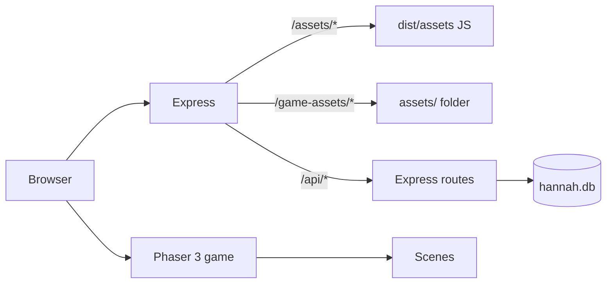

# Architecture overview

## High-level flow



1. `index.html` loads the Vite bundle from `/assets/index-*.js`.
2. `main.js` creates the Phaser game (1280×720 design, responsive scale).
3. `BootScene` preloads assets from `/game-assets/...` then starts `MainMenuScene`.
4. Progress and leaderboard calls go to `/api/*` on the same host (port 5050).

## Scenes

| Scene | Role |
|-------|------|
| `BootScene` | Load assets, show progress bar |
| `MainMenuScene` | Title, start, settings |
| `WorldMapScene` | Zone / level selection |
| `GameScene` | Tilemap, towers, enemies, waves |
| `UIScene` | HUD overlay (runs parallel to GameScene) |
| `VictoryScene` / `GameOverScene` | End-of-battle screens |
| `UpgradeScene` | Meta upgrades between battles |
| `LeaderboardScene` | High scores |

## Gameplay systems

- **PathManager** — enemy path from zone tile data
- **WaveManager** — spawn timing and wave definitions
- **EconomyManager** — sunshine points, costs, rewards
- **ProgressManager** — local + API sync for stars, unlocks, Hannah XP

## Map rendering

- Ground and paths use **Craftpix** isometric-style tiles via `craftpixTiles.js` (direction-based autotiling for paths).
- `responsiveCamera.js` letterboxes/contain-scales the 1280×720 world to any viewport; `mobileViewport.js` handles iOS `visualViewport`.

## Server API

| Route | Purpose |
|-------|---------|
| `GET/POST /api/leaderboard` | Top scores |
| `GET/POST /api/progress` | Player profile, stars, unlocks |

Database schema: `server/db.js` (SQLite, WAL mode).

## Key config

- `src/config.js` — tower stats, wave economy, star thresholds, zone definitions
- `src/utils/AssetRegistry.js` — single source of truth for asset paths

## Build pipeline

```
npm run assets  →  assets/           (from parent source packs)
npm run build   →  dist/assets/      (JS bundle)
                →  dist/game-assets/ (copy of assets/)
npm run start   →  Express serves dist/ + assets/ + API
```

**Important:** Never write game media to `dist/assets/` — that directory is owned by Vite's JS output.
