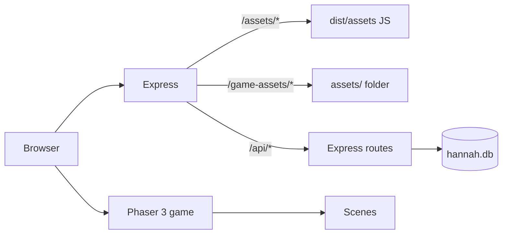

# Architecture overview

## High-level flow



1. `index.html` loads the Vite bundle from `/assets/index-*.js` (Phaser in a separate chunk).
2. `main.js` creates the Phaser game (1280×720 design, responsive scale); end-game scenes load lazily.
3. `BootScene` preloads assets from `/game-assets/...` then starts `MainMenuScene`.
4. Progress and leaderboard calls go to `/api/*` on the same host (port 5050).

## Scenes

| Scene | Role |
|-------|------|
| `BootScene` | Load assets, show progress bar, surface load errors |
| `MainMenuScene` | Title, start, settings |
| `WorldMapScene` | Zone / level selection |
| `GameScene` | Tilemap, wave orchestration, pause (battle logic delegated to `src/battle/`) |
| `UIScene` | HUD overlay (delegates to `src/ui/` modules) |
| `VictoryScene` / `GameOverScene` | End-of-battle screens |
| `UpgradeScene` | Meta upgrades between battles |
| `LeaderboardScene` | High scores |

## Gameplay systems

Battle logic lives in **`src/battle/`** modules used by `GameScene`:

| Module | Responsibility |
|--------|----------------|
| `TowerCombat` | Targeting, projectiles, damage, enemy spawn/death |
| `EnemyBehavior` | Movement, special AI, gate damage |
| `TowerPlacement` | Ghost preview, placement validation, sell |
| `AbilityController` | Hannah abilities |

Shared systems:

- **`WaveManager`** — spawn timing and wave definitions
- **`TutorialManager`** — first-battle tutorial overlay
- **`hannahProgress.js`** — localStorage + server sync (stars, unlocks, tower tiers, Hannah XP)

Paths and maps: **`pathTile2D.js`** + **`pathUtils.js`** (zone layouts, waypoints).

## Map rendering

- Ground and paths use **Craftpix** top-down tiles via `craftpixTiles.js` (direction-based autotiling for paths).
- `responsiveCamera.js` letterboxes/contain-scales the 1280×720 world to any viewport; `mobileViewport.js` handles iOS `visualViewport`.

## Server API

| Route | Purpose |
|-------|---------|
| `GET/POST /api/leaderboard` | Top scores |
| `GET/POST /api/progress` | Player profile, stars, unlocks, tower upgrades |

Database schema: `server/db.js` (SQLite, WAL mode). Progress sync includes `unlocked_zone`, `zone_stars`, `zone_battles`, and `tower_upgrades`.

## Key config

- `src/config.js` — tower stats, wave economy, star thresholds, zone definitions
- `src/utils/AssetRegistry.js` — runtime asset paths under `/game-assets/`
- `scripts/assetCopyManifest.mjs` — copy rules for `npm run assets` (derived from Craftpix tile lists)

## Build pipeline

```
npm run assets  →  assets/           (from parent source packs)
npm run build   →  dist/assets/      (JS bundle + phaser chunk)
                →  dist/game-assets/ (copy of assets/)
npm run start   →  Express serves dist/ + assets/ + API
npm run validate → vitest + asset manifest check
```

**Important:** Never write game media to `dist/assets/` — that directory is owned by Vite's JS output.

## Testing

Vitest covers pure logic in `tests/` (progress math, waves, path tiles, progress API round-trip). Run `npm test` or `npm run validate`.
